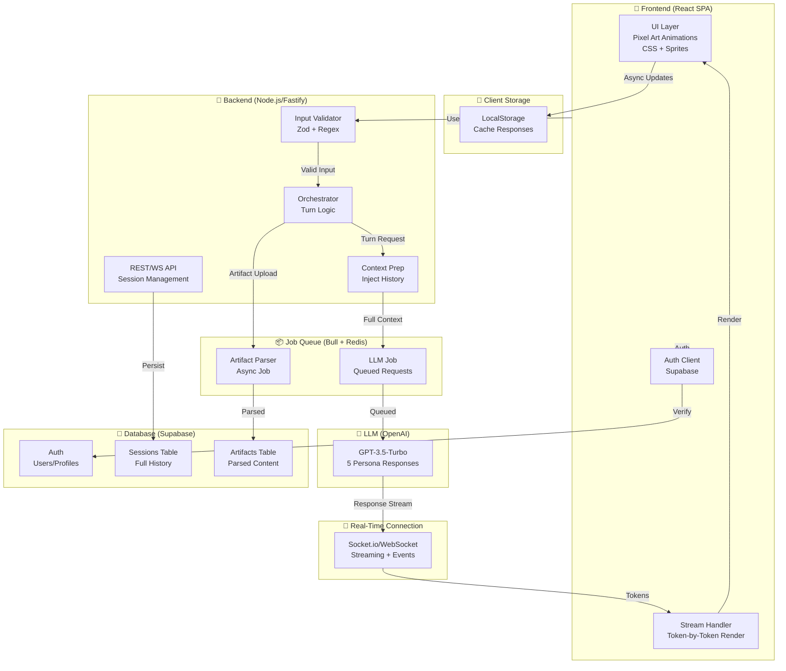

# AI Council - Project Interview & Requirements (10 May 2026)

## Interview Overview
**Interviewer**: GitHub Copilot  
**Interviewee**: Reyyan (Project Owner)  
**Date**: 10 May 2026  
**Status**: 95% Complete Understanding - Ready for MVP Development

---

## PHASE 1: SCOPE & MVP

### Q1: Personas & Artifacts in MVP
**Q**: Are you launching with all 5 foundational personas (Devil, Tyson, Bison, Anshu, Bucks), or a subset?  
**A**: All 5 personas

**Q**: Is artifact upload (PDFs, code, design mockups) in MVP, or launching with just text/prompts initially?  
**A**: With artifact upload in MVP

---

### Q2: User Access Model
**Q**: Is this a logged-in web app only for MVP, or does it need mobile native apps too?  
**A**: Logged-in web app

**Q**: Are we targeting desktop-first initially?  
**A**: Yes, desktop-first

---

### Q3: Real-Time Multiplayer
**Q**: Does MVP support multiple human users in one council session simultaneously?  
**A**: No, single users only. Multiplayer planned for future

---

### Q4: Persona Interaction Complexity
**Q**: For MVP, do personas need to interrupt each other, disagree, and form side-alliances?  
**A**: Yes, but mostly user-prompted. Personas speak when prompted by the user, but capable of dynamic interactions

---

### Q5: Persistence & Sessions
**Q**: Do sessions need to persist/save, or are they ephemeral?  
**A**: Sessions persist & are replayable

---

## PHASE 2: BACKEND & AI ORCHESTRATION

### Q6: LLM Model Strategy
**Q**: Are you committed to a specific LLM provider (OpenAI GPT-4, Claude, Mixtral, etc.)?  
**A**: OpenAI with GitHub student tokens

**Q**: Is cost-per-session a critical constraint?  
**A**: Yes, strictly free resources only (no paid spend). Using only free OpenAI tokens from GitHub student account.

**Q**: Would you consider GPT-3.5-Turbo or Claude 3.5 Haiku instead of GPT-4?  
**A**: Will see (but answered yes to free resources only, which practically means GPT-3.5-Turbo is most viable)

---

### Q7: Persona Conversation Engine
**Q**: When a user prompts the council, should all 5 personas respond in parallel or sequentially?  
**A**: Sequentially, but the user gets to pick which persona replies each time

**Q**: Does each persona need distinct system prompts/instructions, or can they share a base prompt?  
**A**: Distinct system prompts per persona

---

### Q8: Cross-Persona Dynamics
**Q**: When personas "interrupt" or "disagree," is this deterministic or emergent?  
**A**: Emergent

**Q**: Do you need explicit turn-taking logic?  
**A**: Yes, explicit turn-taking logic required

---

### Q9: Artifact Processing
**Q**: For PDFs/code/screenshots: do you need OCR or structured parsing?  
**A**: Structured parsing

**Q**: Is there a file size limit per artifact?  
**A**: 5MB initially (later increased to 15MB with conversation ceiling)

---

### Q10: Streaming vs. Batch
**Q**: Should responses feel real-time/streaming or batch?  
**A**: Real-time/streaming

---

## PHASE 3: FRONTEND & STATE MANAGEMENT

### Q11: Frontend Framework
**Q**: React preferred, or open to others?  
**A**: React

**Q**: Do you need SSR/Next.js for SEO?  
**A**: Not mentioned - SPA is acceptable

---

### Q12: Pixel-Art Rendering
**Q**: Are pixel animations CSS-based, canvas, or sprite sheets + WebGL?  
**A**: Whichever is lighter (implicitly CSS-based)

**Q**: Should animations auto-loop or only play when speaking?  
**A**: Auto-loop idle states

---

### Q13: Real-Time Streaming UI
**Q**: When a persona responds in real-time, does text appear character-by-character, token-by-token, or all at once?  
**A**: Token-by-token

---

### Q14: Session State Management
**Q**: How do you envision storing session state?  
**A**: Hybrid (cache locally with localStorage, sync to backend/Supabase)

**Q**: Do users need to export/download council transcripts?  
**A**: Yes

---

### Q15: Authentication & Users
**Q**: OAuth, custom email/password, or?  
**A**: OAuth (implied with Supabase)

**Q**: Do users have profiles, saved councils, favorites?  
**A**: Yes - profiles and saved councils desired

---

## PHASE 4: BACKEND ARCHITECTURE & DATABASES

### Q16: Backend Framework
**Q**: Node.js (Express/Fastify), Python (FastAPI), or something else?  
**A**: Node.js

**Q**: Serverless functions vs. persistent server?  
**A**: Not specified - persistent server assumed for simplicity

---

### Q17: Database
**Q**: PostgreSQL (relational), MongoDB (document), or Firebase (managed)?  
**A**: Initially asked between three options, but clarified: Supabase (which uses PostgreSQL + managed auth)

---

### Q18: Message Queue / Async Processing
**Q**: Do you need queuing for concurrent LLM calls?  
**A**: Yes, queuing required (Bull + Redis)

---

### Q19: Voice/Audio Features
**Q**: Is voice interaction in MVP?  
**A**: No, text-only for MVP. Voice is future feature.

---

### Q20: Safety & Moderation
**Q**: Do personas need content filters?  
**A**: No explicit content filters required for MVP

**Q**: Should there be user input validation to prevent prompt injection?  
**A**: Yes, strict input validation required

---

## PHASE 5: SCALE & PERFORMANCE TARGETS

### Q21: Expected Load (MVP Launch)
**Q**: How many concurrent users expected in first month?  
**A**: 100 users

**Q**: How many council sessions per day?  
**A**: 100 sessions/day

---

### Q22: Session Complexity
**Q**: Average session length?  
**A**: 30 minutes

**Q**: Average number of turns per session?  
**A**: ~10 turns

**Q**: Each turn = all 5 personas respond?  
**A**: No, user picks which personas respond (1-2 per turn typical)

---

### Q23: Artifact Processing Scale
**Q**: Expected artifacts per session?  
**A**: 2 artifacts average

**Q**: Will you need background jobs for parsing?  
**A**: Yes, synchronous parsing acceptable initially but async preferred for latency

---

### Q24: Cost Per User Session
**Q**: What's your acceptable LLM cost per session?  
**A**: Max $0.50/session

---

### Q25: Latency Expectations
**Q**: When user picks a persona, acceptable response time before streaming starts?  
**A**: < 3 seconds

---

## PHASE 6: CRITICAL BOTTLENECKS & DECISIONS

### Bottleneck #1: LLM Cost Explosion

**Problem**: GPT-4 too expensive for free tokens. Token burn rate high at scale.

**Clarification Q**: 
- A) GitHub student tokens expire?  
  **A**: No, they don't expire
- B) Using free resources only?  
  **A**: Yes, strictly free resources only
- C) Model choice?  
  **A**: Will see (practically: GPT-3.5-Turbo)

**Decision**: Use GPT-3.5-Turbo (cheaper than GPT-4, acceptable quality for personas)

---

### Bottleneck #2: Context Window & Token Explosion

**Problem**: Full session history + artifacts = growing context, token bloat.

**Q**: Truncate old turns or maintain full history?  
**A**: Maintain full session history, but increase artifact limit to 15MB after which conversation ends

---

### Bottleneck #3: Prompt Injection Risk

**Problem**: User controls input, could attempt jailbreaking.

**Q**: Strict input validation or trust system prompt?  
**A**: Strict input validation

**Decision**: Use Zod + regex-based blocklist for input validation

---

### Bottleneck #4: Persona State & Memory

**Problem**: Do personas remember what others said?

**Q**: Should personas have explicit shared context?  
**A**: Yes, personas can reference what others said

**Decision**: Inject full dialogue history into system prompt for each persona request

---

### Bottleneck #5: Latency <3 sec with Sync Artifact Parsing

**Problem**: Parsing 5MB PDF synchronously could exceed latency target.

**Q**: Background async or immediate parsing?  
**A**: Async parsing after session starts (no explicit user trigger)

**Decision**: Use Bull queue for async artifact parsing, don't block session start

---

## PHASE 7: FINAL ARCHITECTURE DECISIONS

### Q26: Model Selection

**Decision**: GPT-3.5-Turbo (free tokens, cost-effective, acceptable persona quality)

---

### Q27: Persona Context Sharing Mechanism

**Q**: How should personas reference prior turns?  
**A**: Injected in system prompt (full dialogue history)

**Decision**: Concatenate all prior turns into system prompt for each new persona response

---

### Q28: Error Handling & Fallbacks

**Q**: What if OpenAI API fails?  
**A**: All three - graceful error + retry with backoff + cached fallback

**Decision Implications**:
- Graceful error messages to user
- Exponential backoff retry (3 attempts)
- Cache responses to show historical results if live API fails

---

### Q29: Session Export & Sharing

**Q**: Need export functionality?  
**A**: Yes

**Q**: Public sharing?  
**A**: Yes

**Q**: Generate highlights?  
**A**: Yes

**Decision**: Implement export to Markdown/PDF, public session sharing (moderation TBD), AI-driven highlights extraction

---

### Q30: Analytics & Metrics

**Q**: Track session duration, turn count, persona popularity?  
**A**: No (skip these for MVP)

**Q**: Track user retention?  
**A**: Yes

**Q**: Track LLM token usage per session?  
**A**: No

**Decision**: Minimal analytics MVP - retention tracking only

---

## EDGE CASES & FINAL CLARIFICATIONS

### Edge Case #1: Token Counting & Conversation Limits

**Problem**: Full history + streaming could exceed token limits indefinitely.

**Q**: Hard turn limit or token limit?  
**A**: "Switch to new conversation" logic (implement later)

**Decision**: Implement hard turn ceiling later (recommended: 50 turns or ~80k cumulative tokens triggers "new conversation" prompt)

---

### Edge Case #2: Persona Consistency with Shared Context

**Problem**: Personas might lose character or repeat points when referencing shared history.

**Q**: Should each persona have unique instructions on how to respond to others?  
**A**: Yes

**Decision**: Each persona system prompt includes explicit instructions on how to respond to other personas' points (e.g., "Devil attacks weak points Bison missed", "Tyson finds hidden opportunities")

---

### Edge Case #3: Async Artifact Parsing UI

**Problem**: Uncertain timing for when artifact becomes available to personas.

**Q**: User-triggered analysis or auto-available?  
**A**: Auto-parsed when ready (no explicit user trigger)

**Decision**: Artifacts queued for parsing immediately on upload, personas can reference once parsing complete. Toast/notification when ready.

---

### Edge Case #4: Input Validation False Positives

**Problem**: Strict validation might reject legitimate prompts.

**Q**: Allowlist or blocklist approach?  
**A**: Not explicitly asked in final phase (defer to implementation)

**Recommendation**: Blocklist-based validation (allow most, reject known injection patterns)

---

### Edge Case #5: Public Session Moderation

**Problem**: Shared sessions could contain offensive content or leaks.

**Q**: Moderation approval or flag/report system?  
**A**: Not explicitly asked (TBD later)

**Recommendation**: Start with basic OpenAI moderation API, implement full moderation system post-MVP

---

### Edge Cases TBD (Post-MVP):
- Session replay architecture (store full responses vs. regenerate)
- Export formatting richness (simple markdown vs. rich HTML/PDF)
- Public session privacy defaults
- Highlights generation timing (batch vs. real-time)

---

## FINAL TECH STACK (LOCKED IN)

### Frontend
- **Framework**: React 18 + TypeScript
- **Styling**: Tailwind CSS
- **Animations**: CSS + auto-loop sprites (pixel art)
- **State Management**: TanStack Query + Context API
- **Real-time**: WebSocket (Socket.io or native)
- **Auth**: Supabase Auth Client (OAuth: GitHub/Google)
- **Persistence**: localStorage (hybrid with backend)

### Backend
- **Runtime**: Node.js 20
- **Framework**: Fastify (lightweight, fast)
- **Language**: TypeScript
- **Database**: Supabase (PostgreSQL + Auth + Real-time)
- **Queue**: Bull + Redis (LLM concurrency, artifact parsing)
- **LLM**: OpenAI SDK (GPT-3.5-Turbo)
- **Input Validation**: Zod + custom regex
- **File Upload**: Multer
- **PDF Parsing**: pdf-parse or pdfjs-dist
- **Streaming**: Socket.io or native WebSocket

### Infrastructure & Deployment
- **Frontend Hosting**: Vercel (or self-hosted)
- **Backend Hosting**: Railway or Render (with Redis)
- **Database**: Supabase Cloud
- **CI/CD**: GitHub Actions

### Key Libraries
- OpenAI SDK (node)
- Bull (job queue)
- Socket.io (WebSocket)
- Zod (validation)
- Multer (file upload)
- pdf-parse (PDF parsing)
- TanStack Query (data fetching)
- Supabase Client (auth + DB)

---

## MVP IMPLEMENTATION ROADMAP (9 WEEKS)

### Phase 1: Foundation (Weeks 1-2)
- [ ] Supabase setup (auth, schema, real-time config)
- [ ] Frontend: React scaffold + Tailwind + TanStack Query
- [ ] Backend: Fastify scaffold + TypeScript + Zod validation
- [ ] Deployment pipeline: Vercel (frontend) + Railway/Render (backend)

### Phase 2: Core Session Engine (Weeks 3-4)
- [ ] Session CRUD endpoints (create, read, update, list)
- [ ] User profiles & saved councils
- [ ] Persona orchestration logic (turn-taking system)
- [ ] OpenAI integration with streaming setup
- [ ] Bull + Redis queue for LLM jobs
- [ ] Context injection system (full history → system prompt)
- [ ] Distinct system prompts for all 5 personas

### Phase 3: Real-Time Streaming (Weeks 5-6)
- [ ] WebSocket/Socket.io real-time connection
- [ ] Token-by-token streaming from LLM → frontend
- [ ] Streaming UI (typewriter effect)
- [ ] Hybrid persistence (localStorage + Supabase sync)
- [ ] Session state recovery on disconnect

### Phase 4: Artifacts & Parsing (Week 7)
- [ ] File upload UI (React component)
- [ ] Backend file handler + validation (15MB limit)
- [ ] Async parsing job in Bull queue
- [ ] Artifact storage in Supabase
- [ ] Toast/UI feedback for parsing status
- [ ] Structured parsing for PDFs, code, images

### Phase 5: Export & Sharing (Week 8)
- [ ] Session export to Markdown
- [ ] Session export to PDF (basic formatting)
- [ ] Public session sharing mechanism
- [ ] Session replay from Supabase
- [ ] Highlights extraction (secondary LLM call)

### Phase 6: Polish & Launch (Week 9)
- [ ] Pixel-art animations finalized
- [ ] Input validation edge case testing
- [ ] Error handling + fallbacks (retry logic, cached responses)
- [ ] Performance testing (latency, streaming quality)
- [ ] Analytics integration (retention tracking)
- [ ] Security audit (prompt injection vectors)
- [ ] Beta launch

---

## SCALE TARGETS (MVP)

| Metric | Target |
|--------|--------|
| Concurrent Users | 100 |
| Sessions/Day | 100 |
| Avg Session Duration | 30 min |
| Avg Turns/Session | 10 |
| User Picks Per Turn | 1-2 personas |
| Avg Artifacts/Session | 2 |
| Artifact Size Limit | 15 MB (conversation ends) |
| LLM Cost/Session | $0.02-0.04 (max $0.50) |
| Latency Target | < 3 sec before streaming |
| Response Stream Type | Token-by-token |

---

## COST ANALYSIS

### Per Session Cost (GPT-3.5-Turbo)
- **Input tokens**: ~2-3k per request (history + artifact + prompt)
- **Output tokens**: ~500-1000 per response
- **Per request cost**: ~$0.001-0.002
- **Avg requests/session**: 10-15 (depending on turns + persona picks)
- **Total cost/session**: $0.01-0.03
- **Budget remaining**: Fits comfortably within $0.50 target

### Monthly Cost Estimate (100 sessions/day)
- **Sessions/month**: 3,000 (100 × 30)
- **Cost/session**: $0.02-0.04 avg
- **Monthly LLM cost**: $60-120
- **GitHub free tokens**: Sufficient for MVP

**Recommendation**: Monitor token usage weekly. Implement "new conversation" logic to add hard ceiling before burn-out.

---

## RISK MATRIX & MITIGATION

| Risk | Severity | Probability | Mitigation |
|------|----------|-------------|-----------|
| **Token burn on free tier** | 🔴 High | High | Monitor weekly, implement turn/token ceiling, plan paid tier migration |
| **Context window overflow** | 🔴 High | High | Full history injected = 2-4k tokens/request. Add hard limit (50 turns or 80k tokens) |
| **Prompt injection attacks** | 🟡 Medium | Medium | Zod + regex blocklist validation, adversarial testing in QA |
| **Artifact parsing latency** | 🟡 Medium | Medium | Async queue + toast feedback. Target: parse within 2-3 sec, non-blocking |
| **Persona consistency** | 🟡 Medium | Medium | Explicit response instructions per persona, QA testing with edge cases |
| **WebSocket stability** | 🟡 Medium | Low | Socket.io auto-reconnect, graceful fallback to polling |
| **Free token expiration** | 🔴 High | Unknown | Unknown expiration date - CRITICAL RISK. Plan migration path early. |
| **Session replay non-determinism** | 🟠 Low | Medium | Store full responses in DB for exact replay (vs. regeneration) |
| **Moderation at scale** | 🟠 Low | Low | Not MVP priority. Add basic OpenAI moderation API pre-launch. |

---

## DECISION LOG

| Decision | Status | Rationale |
|----------|--------|-----------|
| All 5 personas in MVP | ✅ LOCKED | Core value prop, manageable scope |
| GPT-3.5-Turbo (not GPT-4) | ✅ LOCKED | Free tokens only, cost constraint |
| Sequential responses (user picks) | ✅ LOCKED | Reduces complexity, gives user agency, lowers cost |
| Full session history context | ✅ LOCKED | Better persona interactions, coherent responses |
| Async artifact parsing | ✅ LOCKED | <3 sec latency target, Bull queue |
| Supabase (PostgreSQL) | ✅ LOCKED | Managed auth, real-time, simple scaling |
| WebSocket streaming | ✅ LOCKED | Real-time feel, token-by-token UX |
| Hybrid persistence | ✅ LOCKED | Offline capability + backend sync |
| Strict input validation | ✅ LOCKED | Prompt injection prevention |
| Bull + Redis queue | ✅ LOCKED | Concurrent LLM handling |
| Explicit persona response rules | ✅ LOCKED | Maintains character consistency |
| Public sharing (moderation TBD) | ✅ LOCKED | Virality potential, moderation deferred |
| Export + Highlights | ✅ LOCKED | Content creation incentive |
| Retention analytics only | ✅ LOCKED | MVP scope, minimal overhead |

---

## UNKNOWNS & FUTURE DECISIONS

- [ ] **GitHub token expiration**: Unknown when free tier expires - CRITICAL to clarify
- [ ] **Public session moderation**: Approval-based or flag/report system?
- [ ] **Highlights generation timing**: Batch (after session) or real-time?
- [ ] **Session replay architecture**: Store responses vs. regenerate on replay?
- [ ] **Export richness**: Simple Markdown vs. rich HTML/styled PDF?
- [ ] **Turn/token ceiling logic**: Exact thresholds (50 turns? 80k tokens?) and UX messaging
- [ ] **Deployment target**: Railway vs. Render vs. self-hosted?
- [ ] **GPT-3.5 quality validation**: Run test council sessions to validate persona quality

---

## NEXT STEPS

1. ✅ **Complete this interview summary** (done)
2. **Review with team** (if applicable)
3. **Validate GPT-3.5 persona quality** (run 2-3 test council sessions)
4. **Clarify GitHub token expiration date** with GitHub (CRITICAL)
5. **Start Phase 1 development** (Supabase + scaffolding)
6. **Set up monitoring** for token usage tracking
7. **Establish weekly cost review** cadence

---

## APPENDIX: ARCHITECTURE DIAGRAM (Mermaid)

---

## INTERVIEW COMPLETENESS CHECKLIST

- ✅ Phase 1: Scope & MVP (5 questions)
- ✅ Phase 2: Backend & AI Orchestration (5 questions)
- ✅ Phase 3: Frontend & State Management (5 questions)
- ✅ Phase 4: Backend Architecture & Databases (5 questions)
- ✅ Phase 5: Scale & Performance (5 questions)
- ✅ Phase 6: Bottlenecks & Decisions (5 major bottlenecks)
- ✅ Phase 7: Final Architecture Decisions (5 questions)
- ✅ Edge Cases & Clarifications (5 edge cases)
- ✅ Final Tech Stack (locked in)
- ✅ Implementation Roadmap (9 weeks)
- ✅ Risk Matrix (8 risks identified)
- ✅ Cost Analysis & Budget Validation
- ✅ Decision Log
- ✅ Next Steps

**Total Coverage**: 35 questions + 5 bottleneck discussions + 5 edge cases = 45+ decision points documented

---

**Document Version**: 1.0  
**Last Updated**: 10 May 2026  
**Status**: Ready for Development
